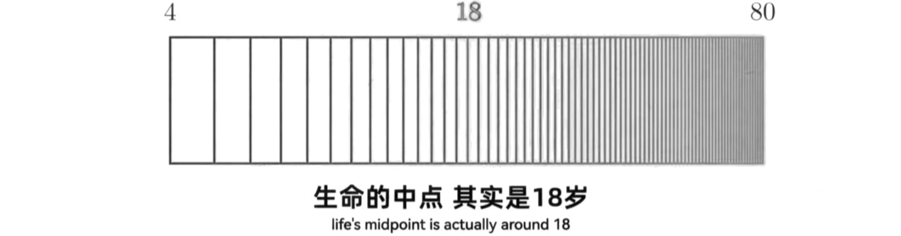
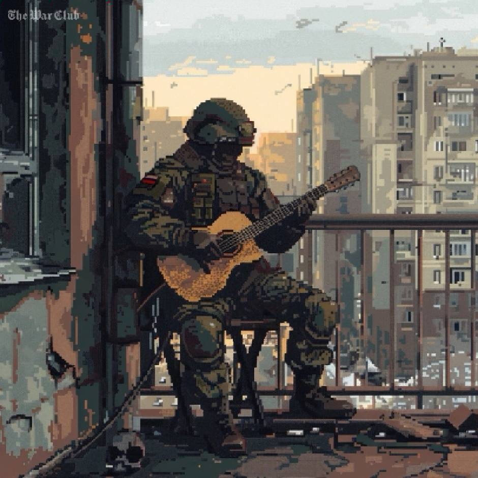
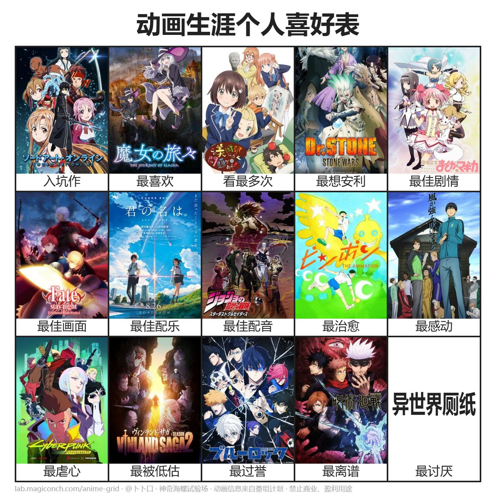
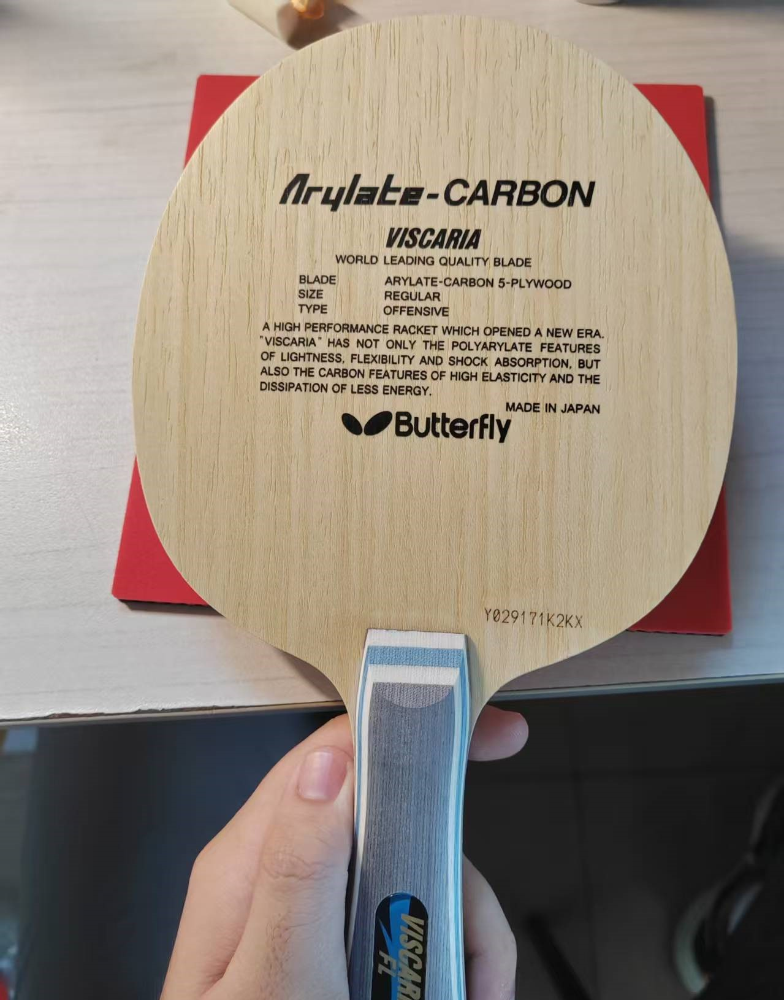
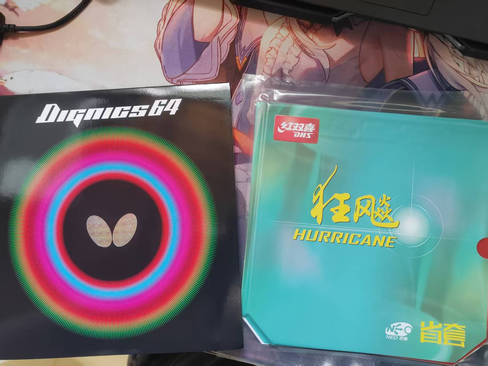
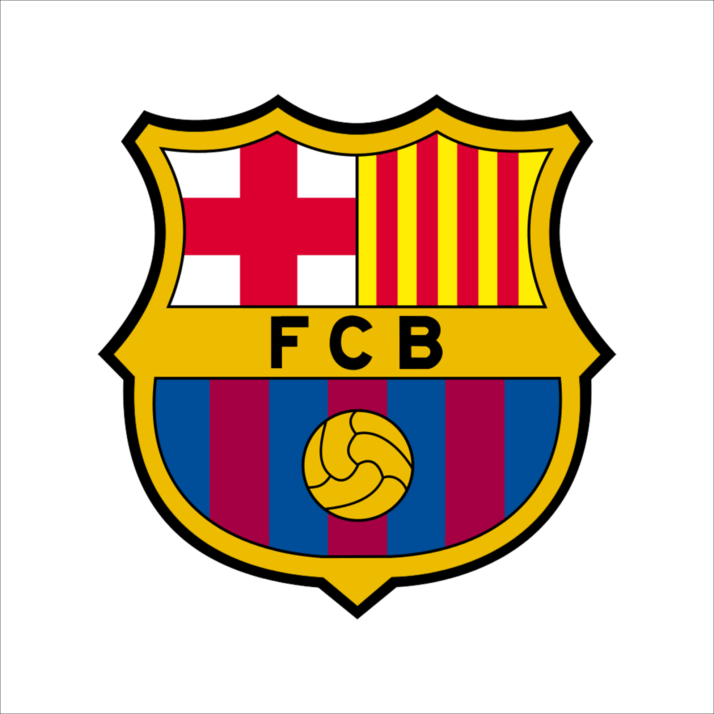

  
  

  

## ✨ Hello, I'm [Truman-min-show] 👋

   

> **“On the logarithmic axis of life, time grows ever denser as it moves on.”**
> 
<strong>“——Thus, the meaning of life lies not in stretching time, but in amplifying experience.”</strong>

  
  

---

## 🧑‍🎓 Education and Research Interests

🎓 Undergraduate in Computer Science and Technology at Tongji University

- Incoming PhD student——direct admission from undergraduate studies

✍ You can often find me in the afternoons or evenings during non-holiday weeks at Room A210 or A208 in Jiading Campus, or at a window seat on the 4th or 8th floor of Library.

Research interests include:

- 🧠 Natural Language Processing (Rumor Detection)
- 🧮 Rough Set and Granular Computing

## 🛠️ Tech Stack

Languages and tools I'm familiar with or currently learning:

## 📈 GitHub Stats

   
   

---

## 🎮 Hobbies and Interests

### 📺 Anime

- Avid anime fan with over **300** series watched, following **3–5** new series each season, and casually catching up on others.

  

### ⚽ Sports

- Night owl soccer fan, supporting **Barcelona** and **Argentina** (Messi is forever the GOAT).
- Table tennis enthusiast (skill level around **1450~1550** on Kaiqiuwang), playing with the right hand, using inverted rubber on both sides of the paddle, primarily focusing on a backhand system, using a VISCARIA-FL blade, 40-degree 2.1 provincial orange rubber Hurricane for forehand, and Dignics-64 for backhand. I focus on backhand quick attacks and the first three shots. Feel free to challenge me at the Jiading Campus table tennis hall on Tuesday/Friday/Weekend afternoons at 3:30  PM or 7:00 PM!

  
  
  

### 🎮 Gaming

- Enjoy a variety of games including FPS (Battlefield series, CrossFire), Souls-like (Elden Ring, Sekiro), sports/racing (FIFA series, Steep, Forza Horizon), open-world (Cyberpunk 2077, Red Dead Redemption 2), war strategy (Hearts of Iron IV), RPG (Resident Evil 4 Remake, The Witcher 3), and hack-and-slash (Dynasty Warriors series).

  

## 🔗 External Links

  <a href="https://space.bilibili.com/481025134?spm_id_from=333.1007.0.0">My Bilibili Profile</a> &nbsp;&nbsp;|&nbsp;&nbsp; 
  <a href="https://blog.csdn.net/Truman_min_show">My CSDN Blog</a> &nbsp;&nbsp;|&nbsp;&nbsp; 
  <a href="https://steamcommunity.com/profiles/76561199494906644/">My Steam Profile</a>

---

## 🌅 In Memory of Richard Russell

> “I’m gonna try to do a barrel roll, and if that goes good, I’m just gonna nose down and call it a night.”  
> 
—— Richard Russell

  

Richard Russell, a ground crew member, made headlines in 2018 when he took an unauthorized plane for a remarkable flight, performing stunts under the sunset before crashing on Ketron Island. His actions sparked deep reflections on ideals, freedom, and the meaning of life, earning him the nickname “Sky King” among netizens.

---

## Acknowledgement

Part of this README template is adapted from my friend [Wangtk311](https://github.com/Wangtk311).  
Special thanks for the inspiration and help.

## Thanks for visiting! If you’re interested in my hobbies, projects, or research directions, feel free to reach out.
