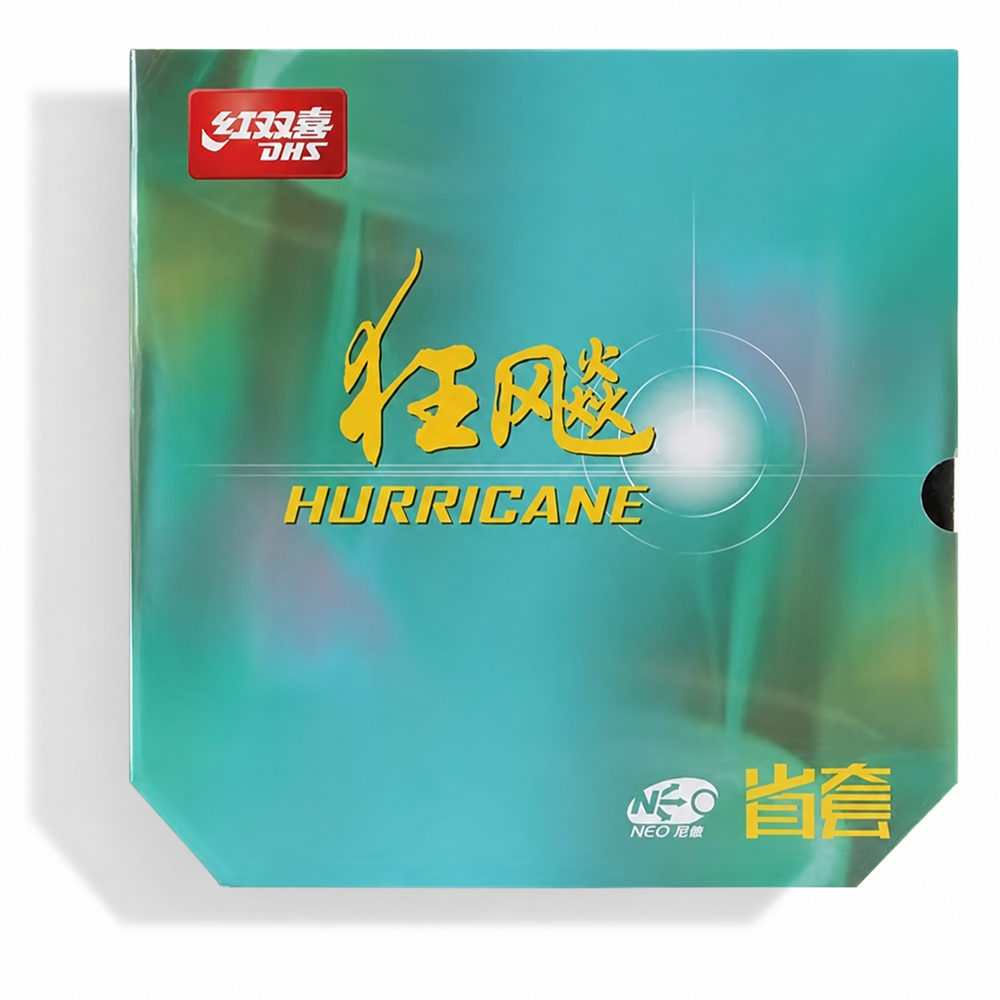
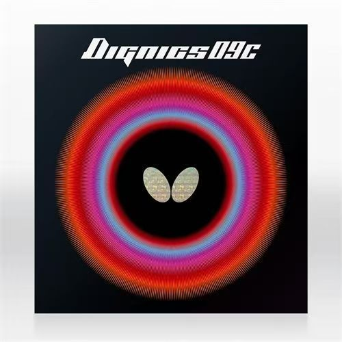

  
  

  

## ✨ Hello, I'm [Truman-min-show] 👋

   

> **“On the logarithmic axis of life, time grows ever denser as it moves on.”**
> 
<strong>“——Thus, the meaning of life lies not in stretching time, but in amplifying experience.”</strong>

  
  

---

## 🧑‍🎓 Education and Research Interests

🎓 Direct-entry PhD student at the College of Computer Science and Technology, Tongji University

✍ You can often find me in the afternoons or evenings during non-holiday weeks at Room A210 or A208, Room 501 in the Telecom Building, or a window seat on the 4th or 8th floor of the Jiading Campus Library.

Research interests include:

- 🤖 Multi-Agent Collaboration, Debate, and Decision-Making (Rumor Detection)
- 🧰 Agent Engineering and Harness Engineering
- 🧮 Rough Set and Granular Computing

## 🛠️ Tech Stack

<h3 align="center">⌨️ Traditional Coding</h3>

<h3 align="center">🧱 Frameworks and Tools</h3>

<h3 align="center">🧭 Automated Research and Vibe Coding Workflow</h3>

## 📈 GitHub Stats

   
   

---

## 🎮 Hobbies and Interests

### 📺 Anime

- Avid anime fan with over **300** series watched, following **3–5** new series each season, and casually catching up on others.

  

### ⚽ Sports

- Night owl soccer fan, supporting **Barcelona**, **Spain**, and **Argentina** (Messi is forever the GOAT).
- Table tennis enthusiast (around **1500–1550** on Kaiqiuwang), playing right-handed with inverted rubber on both sides. My setup is a VISCARIA-FL blade, 39-degree 2.1 provincial orange-sponge Hurricane on the forehand, and Butterfly Dignics 09C on the backhand. My game revolves around backhand banana flicks and mid-to-long-distance rallies. Feel free to challenge me at the Jiading Campus table tennis hall on Tuesday, Friday, or weekend afternoons at 3:30 PM or 7:00 PM!

  
  
  
  

### 🎮 Gaming

- **RPGs are my favorite genre**, especially **Cyberpunk 2077**, **Persona 5 Royal**, **The Witcher 3**, and **Resident Evil 4**. I also enjoy Souls-like games such as **Elden Ring** and **Sekiro**, story-rich open worlds such as **Red Dead Redemption 2**, the **Battlefield** series, football and racing games, co-op adventures, and the occasional quiet journey such as **Death Stranding**.

  

## 🔗 External Links

  <a href="https://space.bilibili.com/481025134?spm_id_from=333.1007.0.0">My Bilibili Profile</a> &nbsp;&nbsp;|&nbsp;&nbsp; 
  <a href="https://blog.csdn.net/Truman_min_show">My CSDN Blog</a> &nbsp;&nbsp;|&nbsp;&nbsp; 
  <a href="https://steamcommunity.com/profiles/76561199494906644/">My Steam Profile</a>

---

## 🌅 In Memory of Richard Russell

> “I’m gonna try to do a barrel roll, and if that goes good, I’m just gonna nose down and call it a night.”  
> 
—— Richard Russell

  

Richard Russell, a ground crew member, made headlines in 2018 when he took an unauthorized plane for a remarkable flight, performing stunts under the sunset before crashing on Ketron Island. His actions sparked deep reflections on ideals, freedom, and the meaning of life, earning him the nickname “Sky King” among netizens.

---

## Acknowledgement

Part of this README template is adapted from my friend [Wangtk311](https://github.com/Wangtk311).  
Special thanks for the inspiration and help.

## Thanks for visiting! If you’re interested in my hobbies, projects, or research directions, feel free to reach out.
