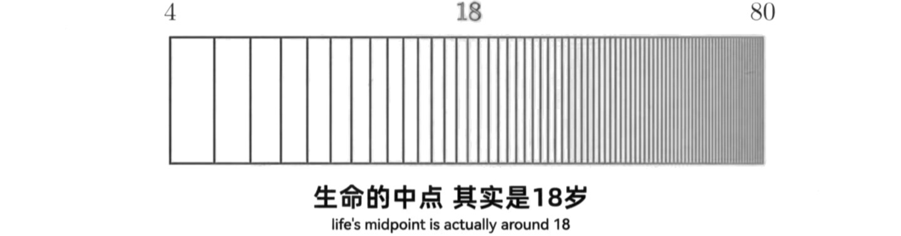
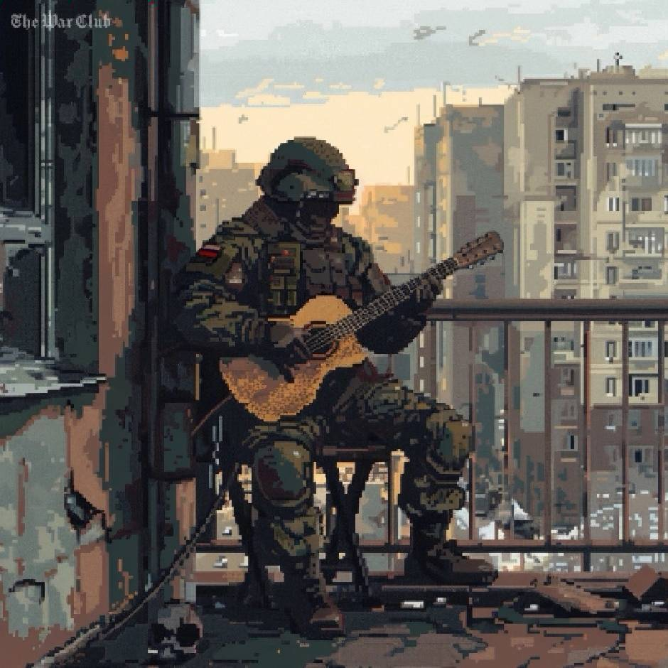
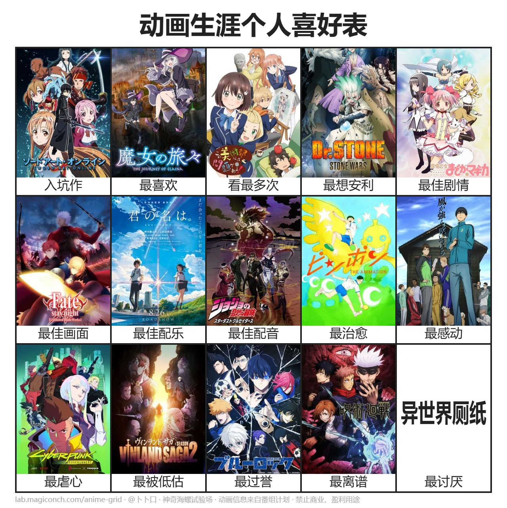
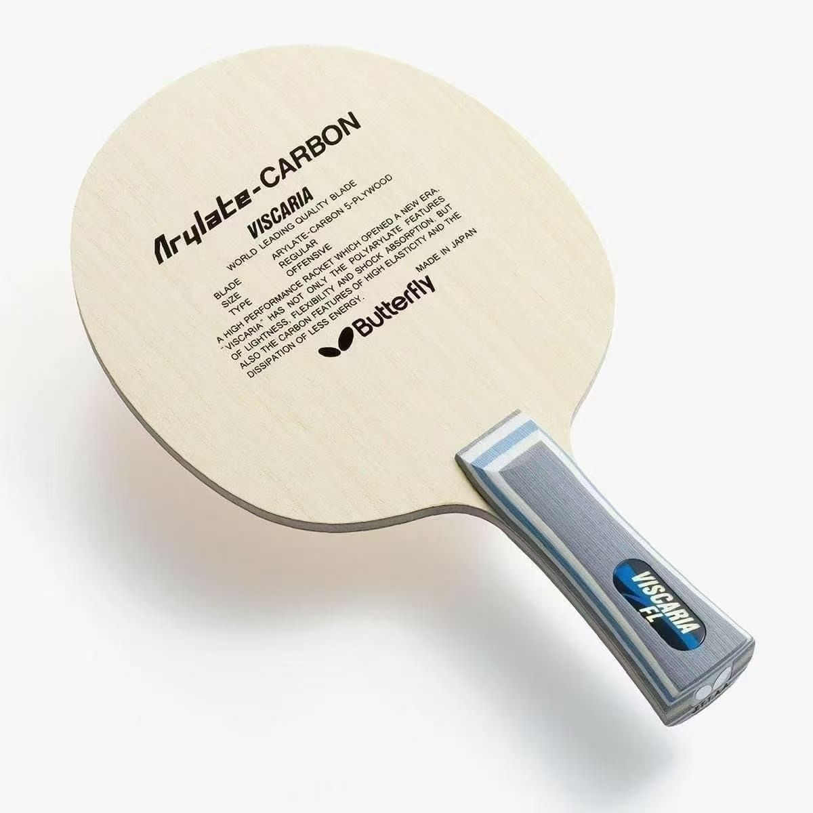
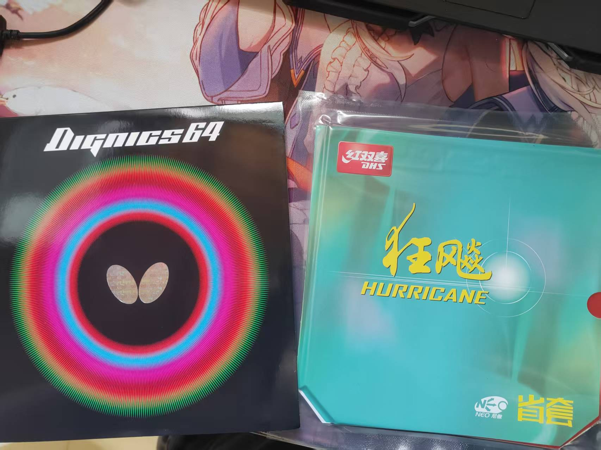
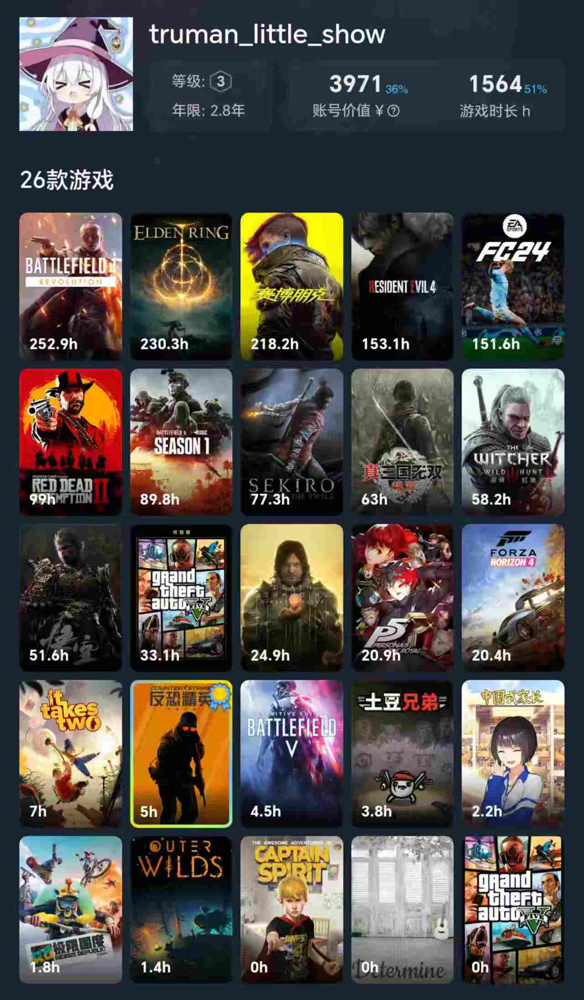

  
  

  

## ✨你好，我是 [楚门的小世界] 👋

   

> **“在人生的对数坐标上，时间越走越挤。”**
> 
<strong>“——于是，生命的意义不在延长时间，而在放大感受。”</strong>

  
  

---

## 🧑‍🎓 教育背景与研究方向

🎓 同济大学计算机科学与技术专业本科生 (博 0 ing)

✍ 你可以经常在非黄金周的下午和晚上于嘉定校区的A210教室或A208教室以及嘉定图书馆4楼或8楼靠窗座位处发现我

研究方向包括：

- 🧠 自然语言处理（谣言检测）
- 🧮 粗糙集和粒计算

## 🛠️ 技术栈

熟悉或正在学习的语言与工具：

## 📈 GitHub 统计

   
   

---

## 🎮 兴趣爱好

### 📺 动漫

- 喜欢看日漫，阅番量 **300+**，每季度定期追番 **3~5** 部，佛性补番

  

### ⚽ 体育运动

- 经常熬夜看球，支持 **巴塞罗那** 和 **阿根廷**（梅西永远的 GOAT）
- 乒乓球爱好者（水平约开球网 **1450~1550** 段位），右手横拍双反，底板维斯卡利亚 FL，正手 40 度 2.1 省橙，反手D64。主打反手快攻和前三板，每周二/五/末下午 3:30 嘉定校区乒乓球馆欢迎约球！

  
  
  

### 🎮 游戏

- 喜欢 FPS（战地系列、穿越火线）、魂类（艾尔登法环、只狼）、体育竞速（FIFA 系列、极限国度、地平线系列）、开放世界（赛博朋克 2077、荒野大镖客 2）、战争策略（钢铁雄心 4）、RPG（生化危机 4 重制版、巫师 3）、割草（真三国无双系列））等多种类型的游戏

  

## 🔗 外部链接

  <a href="https://space.bilibili.com/481025134?spm_id_from=333.1007.0.0">我的B站主页</a> &nbsp;&nbsp;|&nbsp;&nbsp; 
  <a href="https://blog.csdn.net/Truman_min_show">我的CSDN博客</a> &nbsp;&nbsp;|&nbsp;&nbsp; 
  <a href="https://steamcommunity.com/profiles/76561199494906644/">我的Steam主页</a>

---

## 🌅 致敬理查德·罗素（Richard Russell）

> “我想尝试做一个桶滚，如果成功了，我就俯冲下去，结束这一天。”  
> 
—— Richard Russell

  

理查德·罗素（Richard Russell），一位地勤人员，在 2018 年驾驶一架未经授权的飞机在夕阳下完成了惊人的飞行动作，最终坠毁在 Ketron 岛。他的行为引发了人们对理想、自由和生命意义的深思，被网友称为“Sky King”。

---

## 致谢

本 README 模板部分内容来源于我的同学 [Wangtk311](https://github.com/Wangtk311)，在此特别感谢。

## 感谢访问！如果您对我兴趣爱好以及一些项目或研究方向感兴趣，欢迎联系。
